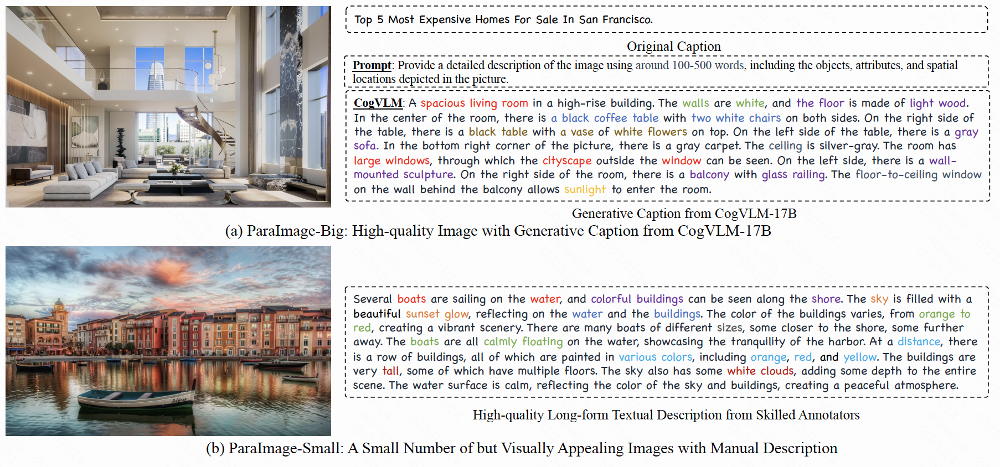
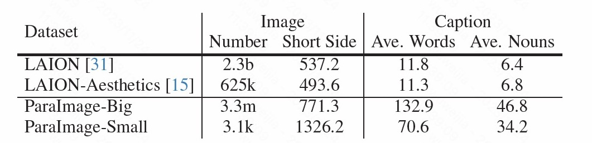
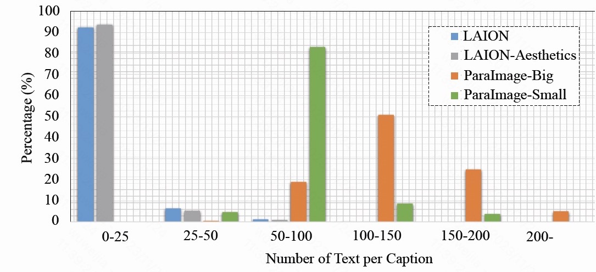
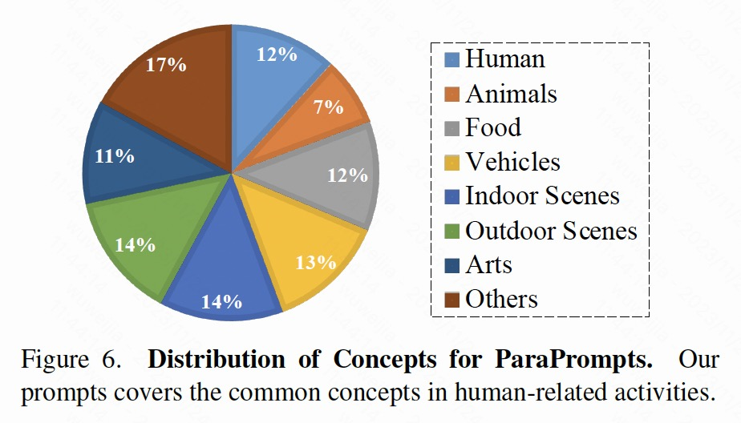
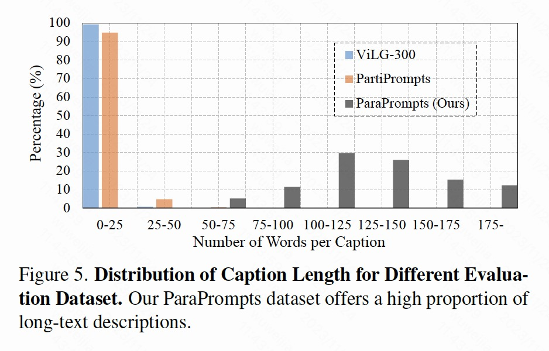

# ParaDiffusion
### 
 Paragraph-to-Image Generation with Information-Enriched Diffusion Model 
 

   &ensp;
   &ensp;

## :notes: **Updates**

- [ ] Nov. 15, 2023. Release the inference code in **three months**.
- [x] Nov. 15, 2023. Rep initialization.

---

## 🐱 Abstract
ParaDiffusion an information-enriched diffusion model for paragraph-to-image generation task, which delves into the transference of the extensive semantic comprehension capabilities of large language models to the task of image generation. At its core is using a large language model (e.g., Llama V2) to encode long-form text, followed by fine-tuning with LORA to align the text-image feature spaces in the generation task. A high-quality paragraph-image pair dataset, namely ParaImage is proposed to facilitate the training of long-text semantic alignment.

---

---

## 🔧 Dependencies and Installation

- Python >= 3.10 (Recommend to use [Anaconda](https://www.anaconda.com/download/#linux) or [Miniconda](https://docs.conda.io/en/latest/miniconda.html))
- [PyTorch >= 1.13.0+cu11.7](https://pytorch.org/)

## ⏬ Download Models

## 💻 Inference

## ✏️ Paragraph-Image Dataset: ParaImage-Small
 
---

The proposed ParaImage dataset mainly includes two parts:

(a) ParaImage-Big: High-quality images with generative captions (ParaImage-Big) are primarily employed for the paragraph-image alignment learning in Stage 2.

(b) ParaImage-Small: Aesthetic images with manual long-term description (ParaImage- Small) are primarily used for quality-tuning in Stage 3.

  

**ParaImage-Small** is a few thousand high-quality images are thoughtfully selected from LAION-Aesthetics, adhering to common principles in photography, then professionally annotated by skilled annotators.

The ParaImage-Small can be download from [Google Drive](https://drive.google.com/file/d/12x0uS0KgD4_NqzJ1A7hLjGkPIwD1Ozud/view?usp=drive_link)

## ✏️ New Prompts Eval: ParaPrompts-400

The current test prompts focus on short text-to-image generation, ignoring the evaluation for paragraph-to-image generation, we introduced a new evaluation set of prompts called ParaPrompts, including 400 long-text descriptions.

The previous prompts testing was mostly concentrated on text alignments within the range of 0-25 words, while our prompts extend to long-text alignments of 100 words or more.

  

## 📖BibTeX

    
## 🤗Acknowledgements
- Thanks to [Diffusers](https://github.com/huggingface/diffusers) for the wonderful work and codebase.
